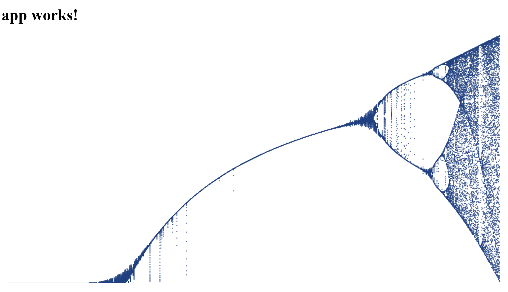

# Using Angular with Docker 

## Service 

In this first step, you will create a service for use by an Angular app and learn how to create an image for it. The service will take a number in the query string and return an array of iterations using something known as a [bifurcation diagram](https://en.wikipedia.org/wiki/Bifurcation_diagram). The bifurcation diagram uses a straightforward recursive function: 

> *x(n+1) = x(n) * r * (1.0 - x(n))*

The *x* represents a percetnage of potential population and the *r* is a factor for environment. The *x* value is typically in the range of 0 to 1 and the *r* value is typically between 0 and 4. 

1. Create a new directory `bifurcation` 

2. Set it as working directory and run `npm init` 

3. Take all of the defaults or enter a description and license as desired 

4. Add the following section to `package.json`: 

    ```JavaScript
"dependencies": {
    "micro": "~6.2.0"
}
````

5. Install the `micro` package with `npm i` 

6. Create a `.gitignore` file and add `node_modules` 

7. Create an `index.js` and populate it with this service: 

    ```JavaScript 
const {send} = require('micro'),
    url = require('url'),
    id = Math.ceil(Math.random() * 999999);
 
module.exports = async (req, res) => {
    try {
        res.setHeader('Access-Control-Allow-Origin', '*');
        let parseUrl = url.parse(req.url);
        console.log(`bifurcation (${id}): request from ${parseUrl.pathname} with query ${parseUrl.query}`);
        if (parseUrl.query) {
            let queries = parseUrl.query.split('&'),
                data = {};
            queries.forEach(query => {
                let queryParts = query.split('=');
                data[queryParts[0]] = Number(queryParts[1]);
            });
            let x = Math.random(), result = []; 
            for (let i = 0; i < 100; i += 1) {
                let xn = x * data.r * (1.0 - x); 
                if (i > 10) {
                    result.push(xn);
                }
                x = xn;
            }
            send(res, 200, {
                id,
                result 
            });
        }
        else {
            send(res, 400, { error: 'Need r and x values!'});
        }
    }
    catch(e) {
        console.log('descriptions error:', e);
        send(res, 500, e.message);
    }
}
```

    The service tags itself with a unique identifier. It parses the query string to get the *r* value, then loads an array with the result of 89 iterations (it ignores the first 11 to allow the *x* value to settle). See how `micro` makes it easy to parse the request and send a response. 

8. In the `package.json` add the following to the `scripts` section: 

    ```JavaScript
"start" : "micro" 
```

9. On the command line, run the service using `npm start` and test it by browsing to [http://localhost:3000?r=3.2](http://localhost:3000?r=3.2) and verify you receive a result.

10. Stop the service and create a `.dockerignore` and `Dockerfile` 

11. Add `node_modules` and `.gitignore` to the `.dockerignore` file 

12. In the `Dockerfile` add: 

    ```
FROM node:6-onbuild`
EXPOSE 3000` 
```
    This first line uses a special image that will package the current Node.js app, and the second line allows the port to be accessed.

13. Build the Docker image: `docker build -t bifurc .` 

14. Run the Docker image: `docker run -i --name bifurcsvc -p 3000:3000 bifurc` 

15. Test the image works by browsing to the same endpoint you did earlier

16. Stop and remove the service (`docker stop bifurcsvc` then `docker rm bifurcsvc`)

## Angular App 

The Angular app will use the service to render a graph of the bifurcation diagram. Obviously the bifurcation equation could be run locally to the app, but this shows not only interaction with a service, but later you will see how to scale the service as well. For now, create a new Angular project from the parent folder of your `bifurcation` service so the created folder is a peer. 

1. `ng new ng-bifurcation` 

2. Make `ng-bifurcation` your working directory 

3. Create a service to generate the bifurcation values: `ng g service bifurcation-generator` 

4. Build the service. The service does a few things: first, it creates an Rx stream that will iterate each point along the width that is passed. Next, for the point it calculates a relative *r* value (0 - 4) and asynchronously calls the bifurcation service to get the array of *x* values back. Finally, it publishes the *r* and *x* values to an observable stream that the consumer can subscribe to.

    ```TypeScript 
import { Injectable } from '@angular/core';
import { Observable, Subject } from 'rxjs';
import { Http, URLSearchParams } from '@angular/http';

export interface IBifurcation {
  r: number;
  x: number;
}

@Injectable()
export class BifurcationGeneratorService {

  constructor(public http: Http) { }

  public generate(width: number): Observable<IBifurcation> {
    let rIterator = Observable.range(0, width - 1).delay(1).map(x => (4.0 * x) / width),
      sync = new Subject<IBifurcation>();
  
    rIterator.subscribe(r => {
      let params = new URLSearchParams();
      params.set("r", r.toString());
      this.http.get('http://localhost:3000/', {
        search: params
      }).subscribe(res => {
        let result = res.json();
        if (result.result && result.result.length) {
          result.result.forEach(x => sync.next({ r, x }));
        }
      });
    });
    return sync.asObservable();
  }

}
```

5. Import the `BifurcationGeneratorService` into the `app.module.ts` file and declare it in the `Providers` array:
    ```TypeScript 
import { BifurcationGeneratorService } from './bifurcation-generator.service';
// etc. etc. 
providers: [BifurcationGeneratorService],
```

6. Modifiy `app.component.html` to add a canvas: 
    ```html
<canvas width="1000" height="500" #canvas></canvas>
```

7. Update `app.component.ts`: 
    ```TypeScript 
import { Component, ViewChild, ElementRef, OnInit } from '@angular/core';

import { BifurcationGeneratorService, IBifurcation } from './bifurcation-generator.service';

@Component({
  selector: 'app-root',
  templateUrl: './app.component.html',
  styleUrls: ['./app.component.css']
})
export class AppComponent implements OnInit {
  title = 'app works!';

  private width: number;
  private height: number;
  private twoDContext: CanvasRenderingContext2D;

  @ViewChild('canvas')
  public canvasElem: ElementRef;

  constructor(public generator: BifurcationGeneratorService) {}

  ngOnInit() {
    let canvas = <HTMLCanvasElement>this.canvasElem.nativeElement;
    this.width = canvas.width;
    this.height = canvas.height;
    this.twoDContext = canvas.getContext('2d');
    this.twoDContext.fillStyle = 'rgba(32, 64, 128, 0.75)';
    this.generator.generate(this.width).subscribe(res => this.plot(res));
  }

  plot(point: IBifurcation) {
    if (this.twoDContext) {
      let x = this.width * (point.r / 4.0);
      let y = Math.floor(this.height - (point.x * this.height));
      this.twoDContext.fillRect(x, y, 2, 2);
    }
  }
}
```

    The component will store the height and width of the canvas, and a 2D context for drawing. The generator begins emitting *r* and *x* values that the `plot` method can use to plot a rectangle to the `canvas` element. 

8. Start the service by running `npm start` in the `bifurcation` directory (or by running the image you created)

9. Start the Angular app by running `ng serve` in the `ng-bifurcation` directory 

10. After a delay, you should see the bifurcation diagram rendered similar to this image: 



## Create a Production Angular image

1. Create a `.dockerignore` in the root of `ng-bifurcation` and add the following: 
    ```
e2e
node_modules
src 
.dockerignore
.editorconfig
.gitignore
angular-cli.json
debug.log 
karma.conf.json
package.json
protractor.conf.js
README.md
tslint.json
```

2. Create a `Dockerfile` and add: 

    ```
FROM nginx 
ADD ./dist /usr/share/nginx/html 
EXPOSE 80
```
    The image is a static nginx webserver. The next step copies the output from the `dist` folder (where the compiled Angular app is located) to the container in a directory that will be served, and the final command exposes the web port. 

3. Build the Angular app for production with ahead-of-time template compilation: `ng build --prod --aot` 

4. Build the Docker image: `docker build -t ngbifurc .` 

5. Run the Docker image and test that it works (ensure the service is running, too!): `docker run -d --name ngbifurcrun -p 80:80 ngbifurc` 

6. Navigate to [http://localhost:80](http://localhost:80) to test it 

7. Stop and remove the container (`docker stop ngbifurcrun` then `docker rm ngbifurcrun`) 

## Compose 

Docker Compose allows you to create a single file that will orchestrate multiple containers. It is a powerful solution because it creates a virtual network that only allows containers to communicate with each other (and are not available from the host machine) and only through explicitly configured ports. 

1. Create a file `docker-compose.yml` in the parent directory above `bifurcation` and `ng-bifurcation` 

2. Populate it: 
    ```
version: '2.1'

services: 

    bifurcation: 
        build: ./bifurcation
        ports:
            - 3000:3000

    web:
        build: ./ng-bifurcation
        ports: 
            - 80:80 
        depends_on: 
            - bifurcation 
``` 

3. Run `docker-compose up`. Once it spins up, navigate to [http://localhost:80](http://localhost:80) to see the app running.

4. Notice the console messages from the single bifurcation service 

5. Stop the running console and type `docker-compose down` 

This is compose! It created the two images and ran them simulatneously with unified console output for you to monitor. 

## Scaling Services 

1. Update the `docker-compose.yml` to this (be sure to overwrite the existing one because some of the existing services change)

    ```
version: '2.1'

networks:
    bifurcnet: {}

services: 

    bifurcation: 
        build: ./bifurcation
        ports:
            - 3000
        networks: 
            - bifurcnet 

    proxy:
        image: dockercloud/haproxy
        depends_on: 
            - bifurcation 
        ports: 
            - 3000:80
        links:
            - bifurcation
        networks:
            - bifurcnet
        environment:
            - DOCKER_TLS_VERIFY
            - DOCKER_HOST 
            - DOCKER_CERT_PATH 
        volumes:
            - /var/run/docker.sock:/var/run/docker.sock

    web:
        build: ./ng-bifurcation
        ports: 
            - 80:80 
        depends_on: 
            - proxy 
```

    Notice that a network is declared, and that the port for the bifurcation service is just `3000` instead of `3000:3000`. This makes it only available to other containers and not from the host. The `proxy` service uses an existing proxy container that uses the `links` command to access the bifurcation service. The proxy by default exposes port 80, so that is mapped back to `3000`. The `environment` section makes certain environment variables set by the Docker host available to the container, and the `volumes` mounts a volume with the host for use. Note that the web service now depends on the proxy instead of the bifurcation service. 

2. Run `docker-compose up` and then visit the website 

    You shouldn't notice any difference except the console information from the proxy. That's because only one instance of the bifurcation service is running. 

3. Without stopping the current services, open a new command line prompt or console and type the following command: `docker-compose scale bifurcation=4`. You should see three more services created and started. 

4. Refresh or open the website in a new tab. Watch the console. You should now see the requests are being load-balanced across all four instances of the service.

5. You've successfully created and run an example of scaling your back end with Docker! 
